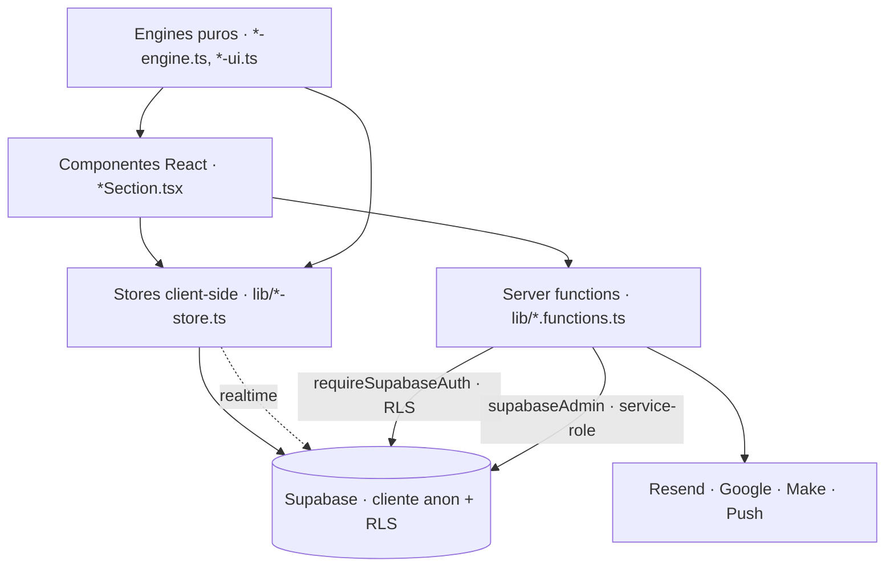

# 02 · Arquitetura (dev)

## Stack
| Camada | Tecnologia |
|---|---|
| Framework | **TanStack Start** (React 19 + TanStack Router, SSR via Nitro/h3), file-based routing |
| Build | Vite 8, TypeScript estrito, gerenciador **bun** (`bun.lock`, `bunfig.toml`) |
| UI | Tailwind v4, shadcn/ui (Radix, estilo "new-york"), lucide-react, TipTap (editor rico) |
| Dados | Supabase (Postgres + Auth + Realtime + Storage), `@supabase/supabase-js`, TanStack Query |
| Deploy | Vercel (`vercel.json`: headers de segurança + 2 crons); código sincroniza com Lovable pelo branch git |
| E-mail | Resend (provedor configurável por admin; webhook de entrega) |
| Outros | Web Push (VAPID), Google Calendar (OAuth), Open-Meteo (clima), WebRTC (chamadas, TURN opcional) |

**Regra de repositório (AGENTS.md):** nunca reescrever histórico já publicado (force-push, rebase/amend/squash) — dessincroniza o Lovable. Arquivos `src/integrations/supabase/*` são gerados.

## Comandos
```bash
bun install
bun run dev        # http://localhost:8080
bun run build
bun run typecheck  # tsc --noEmit
bun run lint
bun run test       # vitest (65 arquivos, 808 testes na última verificação)
bun scripts/release.ts bump|publish   # versão + aviso em tempo real
```
Nota: `vitest` deve ignorar `.claude/worktrees/**` (cópias antigas fazem testes falharem).

## Estrutura de pastas
```
src/
  routes/            rotas (file-based). routeTree.gen.ts é gerado
  components/        telas e peças do app interno (uma *Section por módulo) + ui/ (shadcn) + shared/ (canônicos)
  features/client-portal-v2/   o Portal V2 (layout, páginas, componentes, lib, testes)
  lib/               regra de negócio, stores, server functions (*.functions.ts), engines puros
  hooks/             use-confirm, use-mobile, use-weather, ...
  integrations/supabase/       client, client.server (service-role), auth-middleware, types (gerados)
  styles.css  styles/          tokens (oklch) e utilidades
supabase/migrations/  144 arquivos SQL, timestamp-nomeados, aditivos
public/               PWA (manifest, sw.js sem cache), version.json, sons
docs/                 esta documentação + design-system + auditorias
scripts/release.ts    release local (não há CI)
```

## Rotas

**Layout autenticado** `_authenticated/route.tsx`: confere sessão (redireciona para `/`), `profiles.must_change_password` (→ `/primeiro-acesso`), inicializa stores/sync e a lista do time (poll 30s).

| Rota | Tipo | Função |
|---|---|---|
| `/` | pública | Login (`signInWithPassword`) |
| `/_authenticated/time` | app | **Home do app**: `AppShell` + seção por `?section=` (inicio, clientes, campanhas, projetos, reunioes, comercial, financeiro, time, influenciadores, metas, chat, configuracoes, problemas) e evento `nav:section` |
| `/clientes/$id`, `/projeto/$id` | app | Detalhe de cliente / projeto (únicas seções com rota própria, além do chat) |
| `/chat-v2` (+ `channel/$id`, `dm/$id`, `campaign/$id`) | app | Chat V2 dentro do AppShell |
| `/design-system`, `/design-system-finance-concept` | app | Vitrine interna do design system |
| `/primeiro-acesso`, `/criar-senha`, `/redefinir-senha` | auth | Troca forçada (equipe), convite (cliente), recuperação |
| `/selecionar-ambiente`, `/acesso-pendente`, `/acesso-bloqueado` | auth | Escolha de organização, convite pendente, organização suspensa |
| `/portal-v2/*` | cliente | Portal com login (ver 05) |
| `/portal/$token/*` | cliente | Portal por link (ver 05) |
| `/portal-app/*` | legado | Redirects para `/portal-v2` |
| `/inscricao/$token`, `/nps-influenciador/$token`, `/bugs/$token`, `/calculadora-proposta/$token`, `/email/descadastro/$token` | pública | Páginas por token (ver 05) |
| `/api/public/leads`, `/api/webhooks/resend`, `/api/google/oauth-callback`, `/api/cron/email-flows`, `/api/cron/google-calendar-sync` | máquina | Endpoints (ver 05) |
| `/foco`, `/time-v2`, `/banco-influenciadores-v2` | redirect | Compatibilidade (cutover concluído) |

Observação importante: a maior parte do app interno é **uma SPA dentro de `/time`**, trocada por `?section=` — não são rotas TanStack separadas. `src/lib/section-nav.ts` é a fonte dos tipos e rótulos de seção/aba.

## Camadas



1. **UI** — uma `*Section.tsx` por módulo; subcomponentes na pasta do módulo.
2. **Engines/regra pura** — `entrega-engine`, `metas-engine`, `comercial-engine`, `performance-engine`, `insights-engine`, `aeo-engine` e `*-ui.ts`: sem I/O, testáveis; a UI nunca recalcula saúde/progresso na mão.
3. **Stores** — pub/sub escritos à mão (sem Redux/Zustand): `createTableArrayStore` (uma linha por entidade em `clientes`, `projetos`, `reunioes`, `financeiro_lancamentos`, `banco_influenciadores`, `marketing_tasks`, `metas`, `aeo_*`…), mais `chat-store`, `workspace-store`, `shared-sync` (`shared_state`), `campanha-scoped-store`, `projeto-scoped-store`. Mantêm contrato síncrono `get/set/subscribe`; `init()` roda uma vez no `beforeLoad` do layout autenticado.
4. **Server functions** (`createServerFn`) — 34 arquivos `*.functions.ts`. O token do usuário é anexado por `auth-attacher` e validado por `requireSupabaseAuth` (injeta `supabase`, `userId`, `claims`).
5. **Admin/service-role** — só em `*.server.ts` ou via `await import(...)` dentro de handlers; todo uso de `supabaseAdmin` passa por checagem explícita (`assertAdmin`/`is_admin()` ou validação de token).

## Autenticação e ambientes
- Login por senha; `must_change_password` força `/primeiro-acesso`.
- **MFA** (TOTP) via `mfa.functions.ts`; o portal e o app redirecionam para `/` se o nível de garantia exigir desafio.
- **Ambiente** (`user-environment.server.ts`): lê `organization_members` ativos em `organizations` ativas e devolve `internal`, `client`, `multiple` (→ `/selecionar-ambiente`), `pending` (→ `/acesso-pendente`) ou `suspended` (→ `/acesso-bloqueado`). Home do cliente: `/portal-v2/inicio`; da equipe: `/time`.
- **Convites** (`organization-invites`, `accept-invite`): aceitam convites pendentes ao logar.
- **Recuperação de senha** com rate limit (`rate-limit.functions.ts`) antes de existir sessão.
- **Cofre de senhas** (`vault*.functions.ts`) com TOTP próprio e pedidos de acesso.

## Variáveis de ambiente
| Variável | Uso |
|---|---|
| `VITE_SUPABASE_URL`, `VITE_SUPABASE_PUBLISHABLE_KEY` (+ `SUPABASE_*` no servidor) | cliente Supabase |
| `SUPABASE_SERVICE_ROLE_KEY` | **só servidor**; cliente admin. Não existe localmente por padrão |
| `APP_URL` | origem canônica (redirect do OAuth Google); nunca derivada do request |
| `SITE_URL`, `VERCEL_URL`, `VERCEL_ENV` | origem de links e ambiente |
| `GOOGLE_CLIENT_ID`, `GOOGLE_CLIENT_SECRET` | OAuth do Google Calendar |
| `CRON_SECRET` | Bearer exigido pelos crons |
| `VAPID_PRIVATE_KEY`, `VAPID_SUBJECT`, `VITE_VAPID_PUBLIC_KEY` | Web Push |
| `BLOG_WEBHOOK_URL` | webhook de blog (Make) |
| `VITE_TURN_URLS`, `VITE_TURN_USERNAME`, `VITE_TURN_CREDENTIAL` | TURN para chamadas |
O segredo do webhook de leads **não** é variável: fica em `webhook_settings` (só service-role).

## Build, deploy, versão
- Deploy por observação do branch (Lovable Cloud) / Vercel; **não há CI**.
- `public/version.json` + `VersionWatcher` avisam o usuário quando há bundle novo; `APP_VERSION` em `lib/app-version.ts`.
- `scripts/release.ts`: `bump` (SemVer, roda tsc/eslint/testes, commita) e `publish` (insere em `platform_releases`, disparando aviso em tempo real; o Hypito anuncia).
- Service worker (`sw.js`) existe só para instalação como PWA e **não faz cache**.

## Convenções de código
Alias `@/*` → `src/*`; Prettier 100 colunas, aspas duplas, vírgulas finais; `server-only` do Next é bloqueado (usar `*.server.ts`); migrations novas como arquivos novos, nunca editar antigas.
