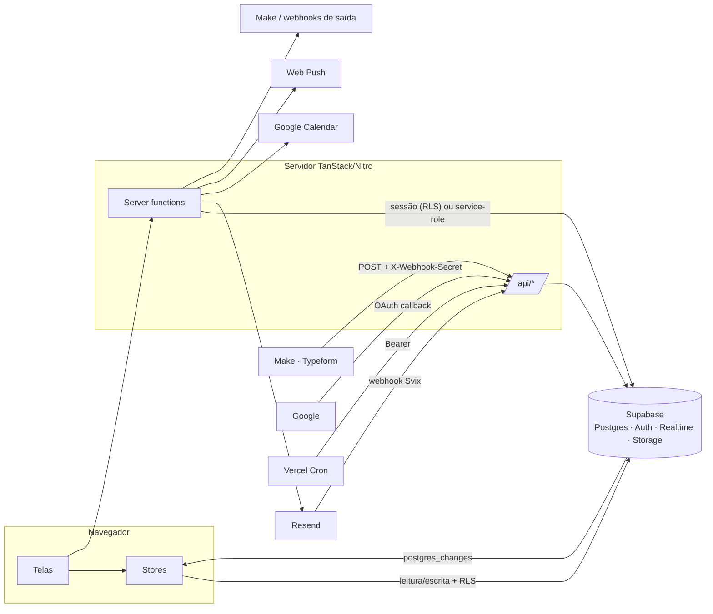
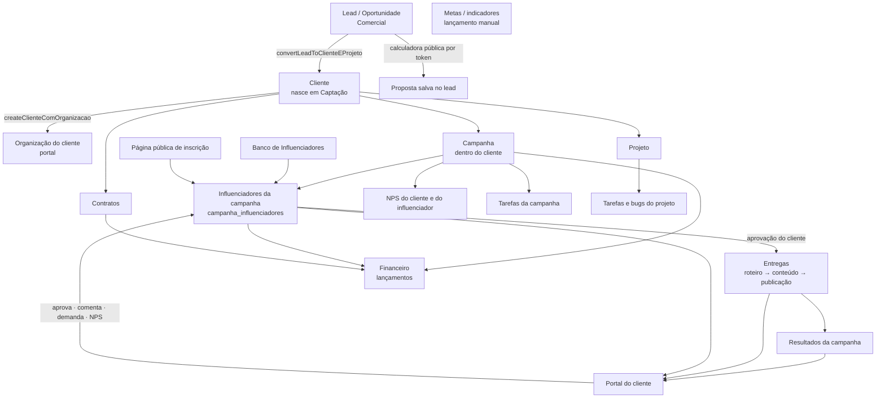

# 06 · Como as partes se comunicam e como as funcionalidades se ligam

## 1. Os canais de comunicação

Há **cinco** formas de uma parte falar com outra. Quase tudo passa pelo Supabase (banco como ponto de encontro); não há fila de mensagens nem API REST própria além dos endpoints `/api/*`.

| Canal | Quem fala com quem | Como |
|---|---|---|
| **Leitura/escrita direta** | Navegador → Supabase | `supabase-js` com a sessão do usuário; RLS decide o que passa. É o caminho dos *stores* (`clientes`, `projetos`, `financeiro_lancamentos`, chat…) |
| **Server functions** | Navegador → servidor → Supabase/serviços | `useServerFn(...)`; token do usuário anexado automaticamente; usadas quando precisa de segredo, service-role, e-mail, regra sensível ou token público |
| **Realtime** | Supabase → navegador | `postgres_changes` em canais nomeados (`rt-*`); atualiza caches e dispara notificações |
| **Webhooks/Endpoints** | Sistema externo ↔ `/api/*` | Entrada: leads, Resend, Google. Saída: webhooks de leads e blog |
| **Agendados** | Vercel Cron → `/api/cron/*` | E-mail flows e Google Calendar, uma vez por dia |

### Tempo real: o que escuta o quê
| Canal Realtime | Tabela / evento | Reação |
|---|---|---|
| `rt-leads-*` (Comercial) | `leads` `*` | Recarrega o pipeline |
| `rt-nav-leads-*` (AppShell) | `leads` INSERT | Notificação de novo lead |
| `rt-campanha-influenciadores-notify` | `campanha_influenciadores` UPDATE | **Ação do cliente** (aprovou/recusou/comentou) vira item no sino da equipe |
| `rt-campanha-tarefas-demand-notify` | `campanha_tarefas` INSERT | **Demanda enviada pelo cliente** vira notificação + toast |
| `rt-chat-channels`, `rt-chat-messages`, `rt-chat-status` | tabelas de chat | Mensagens, status, não lidas, menções |
| `rt-portal-campanha-influenciadores`, `rt-portal-app-…` | `campanha_influenciadores` | O portal do cliente reflete mudanças da equipe |
| `shared_state:changes` | `shared_state` | Estado compartilhado entre abas e pessoas |
| `rt-dashboard-prefs-*`, `rt-bomdia-*` | prefs/briefing | Início e "Bom dia" |
| `rt-<tabela>-*` (stores de lista) | `clientes`, `projetos`, `reunioes`, `financeiro_lancamentos`… | Cache local sincronizado entre usuários |
O cache local também guarda cópia em `localStorage` e o estado do time é consultado a cada 30 s.

## 2. A cadeia principal do negócio

Leitura da cadeia:
1. **Lead → Cliente.** `convertLeadToClienteEProjeto` cria Cliente (sempre **Captação**, nunca Ativo direto), grava `crmLeadId` e cria um Projeto. A ativação é uma ação explícita separada (`ClienteStatusControl`).
2. **Cliente → organização.** Todo cliente novo ganha organização própria; é ela que dá acesso ao Portal V2 e isola dados.
3. **Cliente → campanha → influenciadores.** Influenciadores entram na campanha pelo **Banco**, por **inscrição pública** ou manualmente; passam por curadoria interna e vão ao cliente.
4. **Aprovação no portal.** O cliente aprova/recusa perfis e entregas; isso volta à equipe em tempo real (sino).
5. **Entregas → resultados.** Estado e métricas das entregas alimentam a aba de resultados da campanha. O **relatório mensal** é um arquivo guardado no bucket `relatorios-mensais` e entregue ao cliente por URL assinada (não é gerado a partir das entregas).
6. **Dinheiro.** Lançamentos podem referenciar cliente, campanha e influenciador; contratos geram alerta de vencimento; o financeiro por campanha compõe Análises.
7. **Metas** hoje são alimentadas por **lançamento manual** de indicadores (a fonte `auto` existe no modelo, mas está reservada para o futuro) e produzem saúde por `metas-engine`; o **Time** consome tarefas, entregas e chat para carga, resposta e score.

## 3. Funcionalidades correlatas (quem toca em quem)

| Funcionalidade | Está ligada a | Natureza do vínculo |
|---|---|---|
| **Clientes** | Comercial, Campanhas, Contratos, Financeiro, Portal, Chat (@cliente) | Conversão de lead; campanhas embutidas; organização; menções |
| **Campanhas** | Influenciadores (banco + inscrição), Entregas, NPS, Tarefas, Financeiro, Portal, Chat (@campanha, canal por campanha) | Mesmo `campanha_id` em tabelas `campanha_*` |
| **Banco de Influenciadores** | Campanhas, Financeiro (pagamento), E-mail marketing (picker), Avaliações | Reuso do perfil; dados bancários separados por permissão |
| **Entregas** | Portal (aprovação), Time (semana de entregas), Performance, Resultados | Estado calculado por `entrega-engine` |
| **Comercial** | Clientes, Projetos, E-mail marketing (leads), Webhooks de saída, Calculadora pública | Conversão, `lead.created`/`lead.won`, token de proposta |
| **Projetos/Tarefas** | Chat (@tarefa/@projeto), Time, Início (Meu trabalho), Problemas (bugs de projeto), Metas | `task-aggregation` junta projeto + campanha + marketing |
| **Reuniões** | Google Calendar, Chat (chamada), Início (agenda), lembretes, push | OAuth + cron diário |
| **Financeiro** | Contratos, Campanhas, Influenciadores, Clientes | `clienteId/campanhaId/influenciadorId` no lançamento |
| **Metas** | Independente dos demais módulos (indicadores manuais; `dataSource: auto` reservado) | `metas-engine` |
| **Time** | Chat (tempo de resposta), Tarefas, Entregas, Configurações (score) | `performance-engine`, `get_member_response_time` |
| **Chat** | Todos (menções), Push, Início, Notificações | `mention-kinds`: pessoa, tarefa, projeto, campanha, cliente |
| **Central de Problemas** | Portal do cliente (reporta), Projetos (bugs), links `/bugs/$token`, AppShell (botão), Hypito | Mesma tabela `bug_reports` |
| **Notificações** | Realtime de leads, ações do cliente, demandas, mensagens, release | Sino do AppShell + toast + push |
| **Configurações** | Permissões de todos os módulos, Integrações, Segurança, Score | `profiles.permissions`, `outgoing_webhooks`, `webhook_settings` |
| **E-mail marketing** | Leads, Clientes, Influenciadores (públicos), Resend (envio/webhook), Cron (fluxos), descadastro | `email_*`, `unsubscribe_token` |
| **Blog** | Webhook para o site (Make), Portal (cliente curte/comenta artigos) | `blog_*`, `BLOG_WEBHOOK_URL` |
| **Hypito** | Chat (`hypito_payload`), lembretes, briefing diário, relatórios, alertas, releases | Tabelas `hypito_*` [inferido: serviço externo] |

## 4. Fluxos ponta a ponta

**A. Cliente aprova um influenciador**
Portal V2 → `respondCampanhaInfluSession` → `campanha_influenciadores.data` (inclui `lastClientAction`) → Realtime UPDATE → AppShell mostra item no sino e atualiza o card da campanha; o portal também reflete via seu próprio canal.

**B. Cliente envia uma demanda**
Portal → `submitClientDemandSession` → insere em `campanha_tarefas` → Realtime INSERT → notificação + toast na equipe, e a tarefa entra em "Meu trabalho".

**C. Lead chega de um formulário**
Typeform/Make → `POST /api/public/leads` (segredo) → `leads` → Realtime → pipeline atualiza e AppShell notifica. Ao ganhar/criar pela UI, `lead.won`/`lead.created` saem para os webhooks configurados.

**D. Inscrição de influenciador**
Link `/inscricao/$token` → `submitInscricaoCampanha` (idempotente) → entra na campanha como "inscrito" → aparece na curadoria do Banco/Board → pode ser enviado ao cliente.

**E. E-mail marketing**
Admin cria campanha de e-mail → `activateCampaign` → cron diário avança fluxos → Resend envia → webhook Svix atualiza `email_sends` → descadastro (`unsubscribe_token`) cancela o destinatário em todas as campanhas.

**F. Reunião ↔ Google**
Conexão OAuth (`startGoogleOAuth` → callback) → sync manual (`syncAllMeetingsToGoogle`/`importGoogleEventsToMeetings`) e cron `google-calendar-sync` diário.

**G. Convite de pessoa do cliente**
Admin do cliente (Portal → Configurações → Acessos) ou equipe (Cliente → Acessos ao portal) → server function de convite (link gerado por `auth.admin.generateLink`, enviado por `sendEmail`/Resend) → `/criar-senha` → login → `acceptPendingInvites` → ambiente `client` → `/portal-v2/inicio`. Gate de NPS pode bloquear até responder.

**H. Release**
`scripts/release.ts publish` → `platform_releases` → Realtime → `VersionWatcher`/release notes avisam; `public/version.json` sem cache indica bundle novo.

## 5. Onde a comunicação é frágil (a observar)
- Muita regra depende de **JSONB** (`clientes.data.campanhas`, `*.data`): vínculos não têm chave estrangeira; consistência é por convenção e triggers (`sync_scoped_table_data_id`).
- **Realtime sem fila**: se a aba estiver fechada, a notificação só chega via push ou ao recarregar.
- **Dois chats** (V1 e V2) e **três gerações de portal** convivem; mudanças precisam considerar ambos.
- **Webhooks de saída são best-effort**: falha é só logada.
