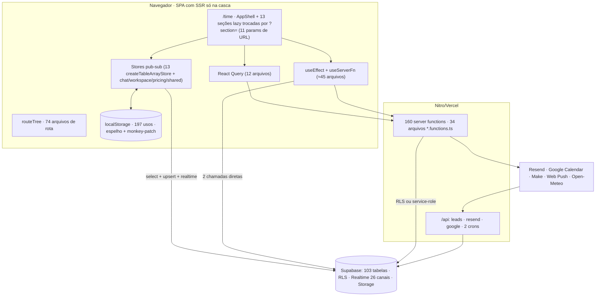

# PLATFORM OPTIMIZATION AUDIT

**Etapa 2 · 3 de outubro de 2026 · somente diagnóstico (nenhum código da aplicação foi alterado)**

Pergunta que guiou o trabalho: *o que está tornando esta plataforma mais complexa, lenta, inconsistente ou difícil de manter do que deveria?* O baseline de segurança ([`../security/relatorio-consolidado.md`](../security/relatorio-consolidado.md)) foi tratado como dado de entrada, não refeito. A etapa 1 ([`auditoria-2026-10.md`](./auditoria-2026-10.md)) já tratou bundle, camada `lib → components` e limpeza; aqui estão as **causas**.

**Executado depois do diagnóstico (2026-10-04, por decisão do produto):** Chat V1 removido (`ChatSection`, `CreateChannelModal`, `chat-sidebar-prefs`; ≈3.100 linhas) e o portal V1 de sessão (`portal-app/*`) reduzido a **um** redirect. O portal por token foi mantido. Itens TD-04 e a linha do Chat V1 em §5.3 passam a "feito"; o restante do diagnóstico segue válido.

**Ganhos rápidos executados (2026-10-04):** PF-05 (`version.json` de 257 KB → 2 KB; histórico em `public/changelog.json`), PF-04 (sem polling de 15 s no Comercial; o card de Comercial do **Início** ainda tem o seu — ver nota), PF-06 (cron de e-mail: 4 consultas por lote em vez de 4 por destinatário, `lib/email-flow-batch.server.ts`), CQ-04 (`secretsMatch` único em `lib/secrets.server.ts`) e a remoção de `ui/accordion` (o pacote `@radix-ui/react-accordion` continua no `package.json`). **Notas:** (1) `InicioDashboard` faz `refetchInterval: 15000` em `["leads"]` sem canal Realtime próprio — não alterado; (2) o cron de e-mail roda 1×/dia (`0 13 * * *`) com `BATCH_SIZE = 50`: o que passar de 50 destinatários vencidos espera o dia seguinte — registro de comportamento, não corrigido.

**Como foi medido.** Grafo de imports e blocos de código por varredura (scripts, não amostragem); migrations em ordem + esquema vivo (`types.ts`); matriz de adoção por módulo; leitura dirigida do código nos pontos críticos. **Limites:** nada foi executado contra o banco vivo nem profilado em runtime. Onde o ganho depende de volume real ou de profiling, está escrito *(medir antes)*.

---

## 1. Executive Summary

A plataforma não é lenta nem complexa por falta de componentes: é por **seis causas estruturais**, cada uma com evidência.

| # | Causa-raiz | Evidência | O que ela produz |
|---|---|---|---|
| C1 | **Camada de dados fragmentada em 4 mecanismos** (stores pub-sub com espelho em `localStorage`; React Query; `useEffect`+`useState` por componente; estado na URL) | React Query em **12 arquivos**; **52 de 60** arquivos com `useServerFn` não usam Query; ≈45 arquivos misturam `useEffect` e chamada de dados; 197 usos de `localStorage` em 60 arquivos; `localStorage` é *monkey-patched* para sincronizar (`shared-sync`) | Fetch duplicado, polling por cima de realtime, loading/erro reimplementados, recargas em O(U²) no chat, 16 tabelas baixadas antes de qualquer tela |
| C2 | **Regra de domínio dentro de arquivos de UI gigantes** | `TaskDialog` = **2.695 linhas** num único componente; `InfluencerBoard` = 46 componentes em 6.091 linhas; **13 arquivos > 1.000 linhas somam 30.045 das 92.683 linhas** de `components/` (32%) | Edição arriscada, re-render de árvores inteiras a cada tecla, impossível testar por unidade |
| C3 | **Não existe taxonomia de controles de página** | `SegmentedControl` faz 3 papéis diferentes (navegação de seção, divisão de dados, modo de visão) com o mesmo visual; Financeiro tem 5, Time 4, Metas 3 | O empilhamento de controles que o Financeiro mostrou **se repete** onde há ≥ 3 camadas (ver §7) |
| C4 | **Sem utilitários compartilhados de formatação/identidade** | 5 formatadores de BRL (+7 inline), **≥ 20** formatadores de data (com semânticas de fuso diferentes), **≥ 12** `initialsOf`/`initials`, 4 `colorFor` | Inconsistência visível e risco de "dia a menos" por fuso |
| C5 | **Legado mantido "para rollback" nunca sai** | Chat V1 (`ChatSection`, 2.833 linhas) com redirect para o V2 há muito; portal por token e portal V2 coexistindo + `portal-app/*` (V1 de sessão aposentado, só guarda e redirects); `version.json` de 257 KB duplicando `platform_releases`; vitrine `/design-system` de 2.647 linhas | Superfície de manutenção e de bundle sem uso |
| C6 | **Adoção do Design System desigual** | Tarefas, Chat, Marketing e Influenciadores usam `<button>` cru 85–110 vezes contra 2–16 `<Button>`; ≈410 usos de paleta direta nos módulos (70% em Tarefas, Marketing, Influenciadores, Configurações e Portal); 20 modais feitos à mão (`fixed inset-0`) | Aparência e acessibilidade divergentes; foco/Esc/aria reimplementados |

**Os 5 achados de maior retorno** (detalhes na §11):
1. **Chat recarrega tabelas inteiras a cada batimento de presença** (O(U²) a cada 30 s) — PF-01.
2. **`get_recent_chat_messages` varre todo o `chat_messages`** a cada login de cada cliente — DB-01.
3. **16 stores baixam tabelas completas antes de qualquer tela** — PF-03 (já no baseline; é a maior dívida de escala).
4. **`version.json` de 257 KB é baixado a cada 5 min por aba** só para ler um número — PF-05 (correção de 10 linhas).
5. **Modelo de dados do app em 4 mecanismos** — decisão de estado (A-01) que destrava PF-03, PF-04 e UX-01.

**Já resolvido na etapa 1** (não repetir): bundle inicial −47% gzip, `lib → components`, 3 remoções de código morto, RLS em migration pendente.

---

## 2. Architecture Map

### 2.1 Como funciona hoje

### 2.2 Inventário real (sem ideal inventado)
| Camada | O que existe | Observação |
|---|---|---|
| Entry points | `router.tsx`, `start.ts`, `server.ts`, `routes/__root.tsx` | `start.ts` anexa o JWT a toda server function e converte erro 500 em página |
| Rotas | 74 arquivos (sem `routeTree.gen.ts`): app (`_authenticated`), portal V2, portal por token, `portal-app` (V1 de sessão aposentado: 1 guarda + 4 redirects + 1 layout vazio), públicas por token, `/api/*` | Quase todo o app interno é **uma rota** (`/time`) com seções por `?section=` |
| Módulos | Início, Clientes, Campanhas, Projetos/Tarefas, Reuniões, Comercial, Financeiro, Time, Influenciadores, Metas, Chat, Marketing, Configurações, Problemas | 92.683 linhas em `components/` (+ ≈6.600 em `features/client-portal-v2`) |
| Estado global | **Sem Redux/Zustand.** 3 `createContext` (2 do portal, 1 de gráfico) | Estado de domínio vive em módulos `lib/*-store.ts` |
| "Repositories/services" | Não existem como camada. Stores fazem o papel de repositório; `*.functions.ts` de serviço | Padrão implícito, não documentado |
| Edge Functions | **Nenhuma** (`supabase/` só tem migrations e `config.toml`) | Servidor = server functions + rotas `/api` |
| Cache | `localStorage` (espelho das stores), caches em memória nos stores, React Query (12 arquivos), `no-store` em `version.json` | 4 caches sem política comum |
| Tempo real | ~26 `.channel(...)`; 8 pollers (15–60 s); 3 intervalos de relógio | Há tabelas com **duas** assinaturas (ex.: `leads` no AppShell e no Comercial) |
| Integrações | Resend, Google Calendar, Make (2 webhooks), Web Push, Open-Meteo | Detalhes em `portal-e-links-externos.md` |
| Testes | 60 arquivos / 734 testes; engines `entrega`, `metas`, `aeo`, `insights` **sem teste** | Cobertura forte em regra pura, quase nula em UI |

---

## 3. Performance Findings

### PF-01 · Chat: recargas de tabela inteira disparadas por eventos de presença/leitura — **P1**
- **Evidência:** `heartbeat` roda a cada 30 s em cada cliente aberto e faz `UPDATE chat_status` (tabela publicada no Realtime). Cada cliente assina `chat_status` com `*` e, a cada evento, executa `reloadStatuses()` = `select` da tabela inteira. O mesmo vale para `chat_reads` (`reloadAllReads` + `reloadReads`) e `chat_deliveries` (`reloadAllDeliveries`) a cada leitura/entrega de **qualquer** usuário.
- **Causa:** o store "recarrega tudo" em vez de aplicar o `payload` do evento (para `chat_messages` o próprio código já faz *patch* em memória, com o comentário de que o reload completo "fazia o chat parecer carregando").
- **Impacto:** com N clientes abertos, a presença sozinha gera **N² selects a cada 30 s** (10 clientes ≈ 100; 30 ≈ 900) *(estimativa por fórmula, não medida)*. Cada reload termina em `emit()`, que re-renderiza todos os assinantes do chat — inclusive o shell.
- **Solução:** aplicar `payload.new` no cache (como já é feito com mensagens); presença por canal `presence` do Realtime em vez de `UPDATE` no banco; recibos incrementais. **Sem migration.** Risco médio (comportamento de presença/recibo).

### PF-02 · `emit()` global a cada 20 s e 30 s — P2
- `chat-store` emite a cada 20 s (derivar "offline") e a cada `heartbeat`; todo assinante do chat (AppShell, `NotificationsBell` de 653 linhas) re-renderiza *(medir antes com React Profiler)*.
- **Solução:** derivar presença no componente que exibe o ponto, não no store global; separar o `emit` de presença do `emit` de mensagens.

### PF-03 · 16 stores baixam tabelas completas antes de qualquer tela — **P1** *(baseline da etapa 1; mantido)*
- `_authenticated/route.tsx` espera `Promise.all` de 16 `init*Sync()` (clientes, projetos, reuniões, **todo** o financeiro, banco de influenciadores, tarefas de campanha/projeto, AEO, metas…), cada uma `select("data")` sem filtro.
- **Impacto:** tempo até a primeira tela cresce com os dados *(medir: tamanho e contagem de linhas por tabela)*.
- **Solução:** inicialização por módulo (`init` ao abrir a seção) para as tabelas que só um módulo usa (financeiro, banco de influenciadores, AEO, metas); manter eager só o que o shell precisa. Exige mapear consumidores do contrato síncrono `get()`. Depende da decisão A-01.

### PF-04 · Comercial: lista inteira + polling + realtime duplicado — P2
- `listLeads` faz `select("*")` **sem limite**; o Comercial refaz a consulta a cada 15 s **e** a cada evento realtime em `leads` (canal próprio); o AppShell tem **outro** canal na mesma tabela.
- **Solução:** remover o `refetchInterval` (ou subir para ≥ 60 s como rede de segurança); um canal por tabela; `select` com colunas do Kanban e carregar `ganho`/`perdido` antigos sob demanda. Risco baixo (visual idêntico).

### PF-05 · `version.json` = 257 KB, baixado a cada 5 min por aba — P2 (ganho rápido)
- O `VersionWatcher` só lê `version`, mas o arquivo carrega todo o changelog (`notes`, `releases`) e é servido com `no-store`. É também **duplicado** pela tabela `platform_releases`.
- **Solução:** `version.json` mínimo (`{ "version": "…" }`) e o changelog fora (ou só em `platform_releases`). Sem migration; risco baixo. ≈ 3 MB/h/aba economizados *(cálculo: 257 KB × 12/h)*.

### PF-06 · Cron de e-mail com N+1 — P2
- `api/cron/email-flows.ts` consulta campanha e descadastro **por destinatário**, em sequência. Cresce com o número de pendentes.
- **Solução:** buscar campanhas e descadastros em lote (`in(...)`) antes do laço. Risco baixo.

### PF-07 · Peso restante da carga inicial — P2
- Landing do app ≈ 1.521 KB / 480 KB gz após a etapa 1. Maiores: `index` 415 KB, `task-directory` 231 KB (conteúdo a abrir), `dist` (cliente Supabase) 199 KB. `ui/accordion` não tem uso; `ui/chart` só é usado na vitrine.
- **Solução:** abrir o `task-directory` e dividir por rota; remover `accordion`; mover a vitrine `/design-system` para fora do bundle de produção ou carregá-la só em desenvolvimento.

### PF-08 · Listas sem virtualização/paginação — P3
- Nenhuma lib de virtualização; Kanbans (Comercial, Tarefas) e listas do Chat renderizam todos os itens. Mitigação existente: 50 mensagens por conversa, filtro de período no Financeiro. O risco cresce com volume *(medir)*.

### PF-09 · Re-render do shell — P3 *(medir antes)*
- `AppShell` (2.258 linhas) assina workspace, chat, reuniões, leads, financeiro e permissões; `NotificationsBell` assina chat, reuniões **e a lista completa de clientes** (com campanhas embutidas). Sem profiling, não dá para afirmar custo; é o ponto a medir primeiro.

---

## 4. Database Findings

| ID | Problema | Impacto | Solução | Risco | Migration? | Prio |
|---|---|---|---|---|---|---|
| **DB-01** | `get_recent_chat_messages` usa `row_number() over (partition by convo_id …)` sobre **toda** a tabela `chat_messages` (e `select cm.*` com JSONB) a cada inicialização de cada cliente | Tempo de login do chat cresce linearmente com o histórico; carga repetida por usuário | Reescrever com `LATERAL` por conversa + `limit 50` usando o índice `(convo_id, created_at)` | Baixo (mesma assinatura e resultado) | **Sim** (`create or replace function`) | **P1** |
| DB-02 | 266 de 309 policies usam `auth.uid()` "nu" e 182 chamam `has_permission`/`is_admin`/`is_internal_team_member` por linha (`SECURITY DEFINER`, não inlinável); nenhuma usa o padrão `(select auth.uid())` | Custo por linha em tabelas grandes (chat, leads, financeiro) *(medir com `EXPLAIN ANALYZE`)* | Reescrever em lotes, começando pelas tabelas maiores, validando plano e resultado | Médio (RLS) | Sim, em lotes | P2 |
| DB-03 | `organization_members` sem índice por `user_id`, usada em quase toda policy via `is_internal_team_member` | Cresce com membros/clientes | Índice parcial (já na migration pendente `20261004`) | Baixo | Já escrita | P2 |
| DB-04 | Assinaturas Realtime sem filtro em `chat_reads`, `chat_deliveries`, `chat_status` | Base do PF-01 | Aplicar `payload` no cliente; filtrar por `user_id`/conversa quando possível | Médio | Não | P1 (junto de PF-01) |
| DB-05 | Publicação Realtime ainda inclui tabelas sem uso (`sudoku_daily_results`, `zip_daily_results`) e histórico de tabelas removidas | Tráfego e metadado inúteis | `alter publication supabase_realtime drop table …` junto da decisão de apagar as tabelas de jogos | Baixo | Sim | P3 |
| DB-06 | `clientes.data` embute campanhas; cada edição regrava a linha inteira e o Realtime a difunde inteira | Tamanho desconhecido *(medir: `avg(pg_column_size(data))`, `max(...)`, nº de linhas)* | Se for grande: mover campanhas para tabela própria (já existe o padrão `campanha_*`) | Alto (modelo) | Sim | P2 *(medir antes)* |
| DB-07 | 53 `select("*")`; 91 de 236 selects sem limite/escopo aparente (heurística) | Dados baixados e descartados; sem paginação | Selecionar colunas; paginar listas ilimitadas | Baixo | Não | P3 |
| DB-08 | FKs de auditoria (`updated_by` etc.) sem índice | Só pesa em exclusão de usuário | Nada agora | — | — | P3 |
| DB-09 | Fonte de verdade do esquema = `types.ts` gerado (103 tabelas, sem drift) | — | Manter conferência no CI futuro | — | — | — |

**Consulta para medir DB-06** (SQL Editor): `select count(*), pg_size_pretty(avg(pg_column_size(data))::bigint), pg_size_pretty(max(pg_column_size(data))::bigint) from public.clientes;` — o mesmo vale para `projetos`, `reunioes`, `financeiro_lancamentos`.

---

## 5. Code Quality Findings

### 5.1 Componentes gigantes (responsabilidades, não só tamanho)
| Componente | Linhas | O que mistura | Divisão com ganho real |
|---|---|---|---|
| `TaskDialog` (`TaskBoard.tsx`) | 2.695 | Formulário, subtarefas, comentários, anexos, tempo, bloqueios, dependências, atividade, ~25 estados | Separar por **seção** com estado próprio (comentários, subtarefas, tempo, dependências). Ganho: re-render por seção, testes, carga lazy |
| `VincularCampanhaDialog` | 1.317 | Wizard de campanha (passos, validação, orçamento) | Um componente por passo + hook do formulário |
| `TaskBoard` | 1.304 | Kanban, filtros, ordenação, drag, criação | Extrair filtros/ordenação para o padrão `FilterToolbar` |
| `CampanhaDetail` | 1.277 | Cabeçalho, KPIs, influenciadores, cronograma, ferramentas | Seções já são independentes: dividir por seção |
| `InicioDashboard` | 1.032 | Dados de 8 cards + layout + prefs | Um hook por card; layout fica |
| `InfluencerDetail` (`portal-widgets`) | 975 | Perfil, entregas, aprovações no portal por token | Compartilhar com `InfluencerBoard` ou reduzir |
| `LeadDrawer`, `InscricaoPageDialog`, `ClienteFormSheet`, `MeetingDialog`, `ChatSection.MessageList` | 698–834 | Formulário + regra + abas | Dividir só os blocos independentes (abas) |

Regra: **dividir por estado e por seção**, não por "componente pequeno". Não há ganho em fragmentar abaixo de ~150 linhas.

### 5.2 Duplicações (origem · diferenças · estratégia)
| Grupo | Onde | Diferença | Fonte de verdade sugerida | Risco |
|---|---|---|---|---|
| Formatadores de **BRL** | `financeiro-entries` (`fmtBRL`), `comercial` (`formatBRL`), `influencer-model` (`fmtBRL`), `InfluencerBoard` (`formatBRL`), `FinanceConceptPage`, 7 `Intl` inline | Casas decimais diferentes (0 vs 2) | `lib/format.ts` com 2 variantes explícitas (`brl`, `brlCompact`) | Baixo, mas visível |
| Formatadores de **data** (≥ 20: `fmtDate`, `formatDate`, `formatDateTime`, `toISODate`, `todayISO`…) | portal, AEO, e-mail, metas, tarefas, chat, clientes, reuniões… | **Semânticas diferentes**: `new Date("2026-08-05")` (UTC) × `T00:00:00` (local) → "um dia a menos" | `lib/utils` já tem `formatIsoDate`/`formatDateToIso` e `lib/timezone` tem Brasília: consolidar nelas | **Médio: é regra de fuso** |
| `initialsOf`/`initials`/`colorFor`/`avatarAccent` (≥ 12) | tarefas, metas, blog, influenciador, portal, time, Config… | Cores e cortes diferentes | `components/shared/avatar` (iniciais + cor determinística) | Baixo (visual) |
| `DemographicMiniChart` + `renderPieLabel` | `portal-widgets` e `shared/DemographicChart` | Idênticos (74 + 25 linhas) | `shared/DemographicChart` | Baixo |
| `Header` das 3 páginas públicas | `bugs`, `inscricao`, `nps-influenciador` | Idêntico (14 linhas) | `components/shared/PublicPageHeader` | Baixo |
| `secretsMatch` (comparação em tempo constante) | 2 crons + webhook de leads | Idêntico (código de **segurança** triplicado) | `lib/secrets.server.ts` | Baixo |
| `PlatformIcon`, `usePersistedState`, `taskMentionsOf`, `linkPreviewIcon`, `formatAnsweredAt`, `getActorName`, `assertArtigoDoCliente`, `checkMustChangePassword` | pares de arquivos | Idênticos | Módulo da camada correspondente | Baixo |
| **Chat V1 × V2** | `ChatSection` (2.833 linhas) × `chat-v2/*` (≈3.900) | V1 sem rota (ver §5.3) | V2 | Ver §5.3 |
| **Portal por token × V2** | Token: 4 rotas reais (≈1.470 linhas) + `portal-widgets` e casca (≈2.620) × V2: `features/client-portal-v2` (7.814). O V2 só compartilha com `components/portal/` o contexto de sessão (≈250 linhas) | O token tem ações que o V2 não tem (reabrir aprovação, editar briefing/anexos, enviar demanda, reportar bug, artigos) | Decisão de produto | Médio |
| Barras de filtro (Campanhas, Projetos, Clientes, Influenciadores) | 4 arquivos quase idênticos | Dimensões diferentes | Já usam `FilterToolbar`; sobra só `*FiltersBar` por dimensão | Baixo |

### 5.3 Código morto (classificação)
| Item | Classe | Evidência |
|---|---|---|
| `ChatSection.tsx` (Chat V1, 2.833 linhas) | **REVISAR (quase morto)** | `time.tsx` redireciona `chat` → `/chat-v2` ("continua intacto como referência/rollback"); o ramo que o renderiza só roda no instante antes do redirect. `components/chat/*` é compartilhado com o V2 e **fica** |
| `routes/portal-app/*` (6 arquivos) | **REVISAR** (parte segura de remover) | `inicio`, `campanhas.index`, `campanhas.$campanhaId` e `…revisar` só redirecionam para `/portal-v2`; `campanhas.tsx` é layout vazio (existe só para os filhos). **`route.tsx` (194 linhas) não é redirect puro:** é a guarda de sessão do V1 (MFA, troca de senha, escolha de ambiente) e importa o contexto de sessão. Remover o conjunto só depois de confirmar que nenhum link salvo/e-mail aponta para `/portal-app` |
| `/time-v2`, `/foco`, `/banco-influenciadores-v2` | REVISAR | Redirects de compatibilidade |
| `ui/accordion` | **SEGURO REMOVER** | Nenhum uso |
| `ui/chart` | MANTER (só vitrine) | Usado só por `/design-system` |
| `/design-system` + `/design-system-finance-concept` (2.647 linhas) | REVISAR | Vitrine interna; não é parte do produto |
| 10 funções `*Session` do portal V2 sem chamador; `access-guards`/`hypito-permissions` | REVISAR | Decisão de produto (baseline) |
| `SectionHeader` com props legadas `tabs`/`kpis` (3 usos só de `title/subtitle/action`) | REVISAR | Wrapper de `PageHeader` |
| ~63 exports com uma ocorrência | REVISAR | Podem ser usados dinamicamente |
| `@tailwindcss/vite`, `vite-tsconfig-paths`, `@tiptap/pm` | MANTER | Plugins/peer deps (o wrapper do Lovable os traz) |
| `@types/*`, `@vitejs/plugin-react`, `eslint-config-prettier` | REVISAR | Sem referência direta; podem vir por config |

### 5.4 Tipagem e disciplina
- **218 casts** que contornam o tipo: 74 `as any`, 84 `as unknown as`, 60 `as never` (concentrados em acesso a JSONB e server functions).
- **66 supressões** de `react-hooks/exhaustive-deps` (risco de closure velha) e 99 warnings (72 de `react-refresh`).
- Engines **sem teste** que decidem regra visível: `entrega-engine` (status/ações de entrega), `metas-engine` (saúde), `aeo-engine`, `insights-engine`.

---

## 6. Design System Findings

### 6.1 Matriz de adoção por módulo (medida no código)
Agrupamento reproduzível por arquivos: *Clientes* = `ClientesSection` + `clientes/`; *Campanhas* = `CampanhasSection` + `VincularCampanhaDialog` + `campanhas/`; *Reuniões* = `ReunioesSection` + `meetings/`; *Time* = `TimeSection` + `team/` + `time-v2/`; *Chat* = `ChatSection` + `chat/` + `chat-v2/`; *Marketing* = `MarketingSection` + `marketing/`; *Portal* = `portal/` + `features/client-portal-v2/`; os demais = `<Nome>Section` + pasta homônima. Contagem de ocorrências de JSX/classes.

| Módulo | Arq. | Linhas | Cabeçalho | KPI | Filtros | EmptyState | `<Button>` | `<button>` cru | `<input>` cru | Modal à mão | Paleta direta |
|---|---|---|---|---|---|---|---|---|---|---|---|
| Clientes | 10 | 3.867 | ✔ | 5 | 16 | 6 | 28 | 19 | 13 | 0 | 12 |
| Campanhas | 12 | 6.940 | ✔ | 14 | 6 | 4 | 32 | 44 | 29 | 2 | 17 |
| Projetos | 4 | 1.715 | ✔ | 4 | 6 | 2 | 12 | 15 | 3 | 0 | 0 |
| Comercial | 8 | 2.939 | ✔ | 5 | 15 | 2 | 19 | 11 | 0 | 0 | 0 |
| Financeiro | 23 | 4.358 | ✔ | 6 | 3 | 2 | 10 | 38 | 11 | 4 | 18 |
| Reuniões | 11 | 4.329 | ✔ | 4 | — | 2 | 31 | 47 | 8 | 0 | 10 |
| Time | 16 | 5.956 | ✔ | 9 | 10 | 1 | 10 | 26 | 0 | 0 | 28 |
| Metas | 18 | 4.184 | ✔ | 8 | 5 | 4 | 15 | 34 | 17 | 0 | 0 |
| Problemas | 4 | 2.050 | ✔ | 5 | 14 | 3 | 9 | 15 | 3 | 0 | 23 |
| **Tarefas** | 16 | 9.993 | — | 0 | — | 0 | **2** | **109** | 15 | 0 | **112** |
| **Chat** | 25 | 7.500 | — | 0 | — | 0 | 14 | **85** | 11 | **5** | 10 |
| **Marketing** | 48 | 7.488 | ✔ (`SectionHeader`) | 0 | — | 0 | 11 | **110** | **41** | 3 | **58** |
| **Influenciadores** | 7 | 8.089 | ✔ (`SectionHeader`) | 0 | 6 | 0 | 16 | **103** | **55** | 0 | **44** |
| Configurações | 16 | 4.405 | próprio (`SettingsSectionHeader`) | 0 | — | 2 | 36 | 15 | 21 | 2 | 39 |
| Portal | 61 | 9.440 | próprio | 12 | — | 16 | 33 | 61 | 12 | 4 | 37 |
| Início (referência) | 6 | 2.731 | identidade própria | 0 | — | 6 | 6 | 18 | 5 | 0 | 0 |

*Leitura:* `<button>` cru inclui chips, abas e gatilhos de popover que podem ser legítimos; a coluna mostra **onde** o controle canônico ainda não chegou, não um total de erros. "Filtros" = `FilterToolbar` e suas peças (`FilterSearch/Popover/Group/Pill/Chips`, `SortMenu`). Os totais fora dos módulos (`shared/`, `ui/`) não entram.

### 6.2 Leitura
- **Onde cada módulo criou o próprio padrão:** *Tarefas* (`tasks/`, reaproveitado por Projetos, Campanhas e Marketing), *Chat*, *Influenciadores* e *Configurações* (cabeçalho e cartões próprios: `SettingsSectionHeader`, `SettingsCard`). O Chat tem pouca paleta direta (10), mas 85 `<button>` crus e 5 overlays próprios.
- **Causa:** esses módulos nasceram antes dos canônicos e são grandes demais para migrar "de passagem"; os 9 módulos já migrados são os de lista/painel. Não é falta de decisão de design, é **custo de migração concentrado em 3 arquivos** (`TaskBoard`, `InfluencerBoard`, `ChatSection/chat-v2`).
- **Paleta direta (≈410 nos módulos):** Tarefas (112), Marketing (58), Influenciadores (44), Configurações (39) e Portal (37) concentram ~70%. É o mapeamento status → token (decisão C3 do DS) ainda não executado.
- **Modais à mão (20 nos módulos; 29 em todo `components/`, incluindo primitivas):** perdem foco preso, Esc e `aria`; devem virar `Dialog`/`Sheet`.
- **Desvios menores:** 13 `animate-pulse` no lugar de `Skeleton`; ~30 "chips" `rounded-full border` próprios (Chat 11, Marketing 8).
- **Contrato × código:** o `DESIGN-SYSTEM.md` ainda marca P1–P4 como "PRECISA DE DECISÃO", mas as decisões (select nativo, texto de marca, scroll horizontal de tabela, pipeline neutro) já foram tomadas e aplicadas — o documento está atrás do código.

### 6.3 O que **não** padronizar
Kanban do Comercial, workspace de tarefa, composer do Chat e calendário têm arquitetura própria legítima. O alvo é linguagem (tokens, controles, estados), não layout.

---

## 7. UX Complexity Findings

**Pergunta:** o problema do Financeiro (camadas de período/filtro) vem de um padrão arquitetural? **Sim.**

**Padrão causador:** (a) `SegmentedControl` serve a três papéis com o mesmo visual — *navegar entre seções*, *dividir dados* e *trocar modo de visão* — então qualquer módulo com mais de um desses vira uma pilha de segmentados; (b) o contexto (período, mês) e o filtro de dados são o mesmo tipo de controle para quem constrói a tela; (c) não há um "esqueleto" de página, então cada módulo decide a ordem dos blocos; (d) o estado desses controles vive em lugares diferentes (URL no Financeiro/Comercial/Metas, `useState` nos demais).

| Módulo | Camadas acima do conteúdo hoje | Mesmo padrão? |
|---|---|---|
| Financeiro (corrigido) | cabeçalho · navegação · período · KPIs · (dentro) segmento · filtros | Era o caso extremo: 5 segmentados |
| Metas | segmentado Objetivos/Indicadores · KPI-filtro · barra de busca/filtros · (dentro) chips | **Sim**: KPI e chips também filtram |
| Time | período (segmentado) · 2 faixas de KPI · busca/filtros/ordenar | Parcial: 2 faixas de KPI no mesmo bloco |
| Reuniões | segmentado Agenda/Calendário · botão Solicitações com badge · KPIs | Parcial |
| Tarefas | modos de visão + filtros + ordenação + 12 popovers no `TaskBoard` | **Sim**, concentrado num arquivo |
| Influenciadores | banco V2: filtros; `InfluencerBoard`: 14 overlays | Sim no board |
| Comercial, Clientes, Projetos, Campanhas, Problemas | cabeçalho · (contexto) · KPIs · busca+filtros | Já no padrão |

**Taxonomia que resolve a causa** (decisão de design, não componente novo): *Contexto* (período/mês: 1 por página) · *Navegação* (seções da mesma página: âncora ou `SegmentedControl` único) · *Divisão* (tipo de dado: 1 segmentado acima da busca) · *Filtro* (popover único) · *Ordenação*. Cada camada aparece **no máximo uma vez**.

**Existe um esqueleto real?** Sim: 9 módulos já seguem *Cabeçalho → Contexto → KPIs → Busca+Filtros → Conteúdo*. Isso justifica **documentar a ordem como contrato** (já em `DESIGN-SYSTEM.md` §3) e só então avaliar um `PageScaffold` fino (espaçamento e ordem); sem decisão de produto, não criar abstração.

Outros sinais estruturais: drawers/overlays densos (`InfluencerBoard` 14, `TaskDialog`, `LeadDrawer` já reorganizado); páginas profundas (Projeto → E-mails → campanha → 4 abas; inscrição com 3 abas + preview); ações escondidas em menus "⋯" no drawer do Comercial.

---

## 8. Documentation Findings

Hoje: ~2.900 linhas em 6 áreas. Estrutura boa; o problema é **conteúdo atrás do código** e sobreposição.

| Documento | Classe | Problema | Ação proposta |
|---|---|---|---|
| `design-system/DESIGN-SYSTEM.md` | **ATUALIZAR** | 5 marcadores "PRECISA DE DECISÃO" de decisões já tomadas e aplicadas (P1–P4) | Trocar cada marcador pela regra fechada |
| `design-system/DECISIONS.md` | **ATUALIZAR** | "Abertas" P1–P4 e confirmações C2/C7 já decididas | Marcar como fechadas, com data |
| `design-system/AUDIT-FINDINGS.md` | **ARQUIVAR** | Diagnóstico de antes da migração; números superados por `APLICACAO-E-MIGRACAO.md` e por esta auditoria | Mover para `design-system/archive/` |
| `design-system/technical/*` (5 arquivos, ~500 linhas) | **ARQUIVAR** | Engenharia reversa do Início, com trechos desatualizados ("outros módulos não usam `Card`") | Mover para `archive/`; `INICIO-REFERENCE.md` basta |
| `security/README.md` × `security/relatorio-consolidado.md` | **CONSOLIDAR** | O README repete o estado que o consolidado já traz | README vira só índice + link |
| `architecture/riscos-e-lacunas.md` × `architecture/auditoria-2026-10.md` §12–13 × este documento §11 | **CONSOLIDAR** | Três listas de pendências | Um `docs/BACKLOG.md` vivo (a matriz da §11) |
| `architecture/dados-e-acesso.md` (trecho de segurança) | ATUALIZAR | Sobrepõe o consolidado de segurança | Reduzir a um ponteiro |
| `public/version.json` (changelog) × tabela `platform_releases` | **CONSOLIDAR** | Duas fontes de "notas de versão" | Ver PF-05 |
| PDFs (`architecture/…pdf`, `security/…pdf`) | MANTER | Derivados; ficam velhos quando o `.md` muda | Regra: regenerar ao alterar (ADR 0003) |
| `modules/README.md` | MANTER | Útil, 80 linhas | — |

**Faltam (apenas o que paga o próprio custo):** (1) **ADR de estratégia de estado/dados** (A-01), a decisão que destrava PF-03/PF-04; (2) `BACKLOG.md` único; (3) opcional: runbook curto de crons/webhooks (o que faz, como reexecutar). **Nada mais.**

---

## 9. Technical Debt

| ID | Dívida | Evidência | Custo de manter |
|---|---|---|---|
| TD-01 | 4 mecanismos de estado/dados | §1 C1 | Duplicação de fetch, bugs de sincronização, onboarding difícil |
| TD-02 | 218 casts de tipo e 66 supressões de `exhaustive-deps` | §5.4 | Bugs de runtime que o compilador não pega |
| TD-03 | Engines sem teste (`entrega`, `metas`, `aeo`, `insights`) | §5.4 | Regra de negócio sem rede de segurança |
| TD-04 | Legado "para rollback" (Chat V1, `portal-app`, vitrine, `SectionHeader` legado) | §5.3 | ≈5.500 linhas sem uso no produto |
| TD-05 | Dois portais com recursos diferentes | §5.2 | Mudança precisa ser feita duas vezes; clientes em modelos distintos |
| TD-06 | 4 caches sem política (LS, memória, Query, `no-store`) | §2.2 | Dado velho/inconsistente entre abas |
| TD-07 | Datas: ≥ 20 formatadores com fusos distintos | §5.2 | Risco de "dia a menos" |
| TD-08 | Sem CI: nada roda `typecheck/lint/test/build` automaticamente | baseline | Regressão chega ao deploy |
| TD-09 | `shared-sync` faz *monkey-patch* de `localStorage` | `lib/shared-sync.ts` | Comportamento global implícito; difícil de depurar |
| TD-10 | Duplicação de pares de função idênticos (~20) | §5.2 | Correção precisa ser replicada |

---

## 10. Security Carry-over

Somente o que já está no baseline — **preservado no backlog**, nenhum item novo:

| ID | Pendência | Estado |
|---|---|---|
| SC-01 | Migration `20261004000000` (RLS interna + storage + índice) | Escrita e enviada ao repositório; **não aplicada**; conferir banco vivo |
| SC-02 | Leaked Password Protection (painel Supabase) | Aberto |
| SC-03 | Rate limit de escrita pública por token (inscrição, NPS, bugs, proposta, comentários) | Aberto |
| SC-04 | Rate limit de login é consultivo; conferir limites nativos do Auth | Aberto |
| SC-05 | CSP (primeiro `Report-Only`) | Aberto |
| SC-06 | Tipos MIME por bucket + magic bytes | Aberto |
| SC-07 | Replay no webhook de leads | Aberto (regra de negócio) |
| SC-08 | `access-guards`/`hypito-permissions` e 10 funções `*Session` sem chamador | Decisão de produto |
| SC-09 | Dependências só de build/dev com advisory | Acompanhar |
| SC-10 | Limites de desenho aceitos (sessão em IndexedDB, chave do cofre no banco, `author_id NULL`) | Documentado |

*Interseções com este diagnóstico:* SC-01 e DB-02/DB-03 mexem nas mesmas policies — aplicar SC-01 **antes** de reescrever policies para `initPlan`.

---

## 11. Priority Matrix

Prioridades: **P0** crítico · **P1** alto · **P2** médio · **P3** baixo. Esforço: B (horas) · M (dias) · A (semanas). Nada é P0 nesta etapa: não há falha que cause perda de dado ou indisponibilidade hoje.

| ID | Categoria | Problema | Causa | Impacto | Risco | Esforço | Prio | Solução |
|---|---|---|---|---|---|---|---|---|
| PF-01 | Performance/Dados | Chat recarrega tabelas inteiras a cada batimento/leitura/entrega | Store "recarrega tudo" em vez de aplicar `payload` | N² selects/30 s; re-render global | Médio | M | **P1** | Patch incremental; presença via canal `presence` |
| DB-01 | Banco | `get_recent_chat_messages` varre todo o `chat_messages` por login | Window function sobre a tabela inteira | Login do chat cresce com o histórico | Baixo | B | **P1** | `LATERAL` + `limit` por conversa (migration) |
| PF-03 | Performance/Dados | 16 tabelas completas antes da primeira tela | Contrato síncrono `get()` + init no `beforeLoad` | Tempo inicial cresce com os dados | Alto | A | **P1** | Init por módulo; depende de A-01 *(medir volume)* |
| A-01 | Arquitetura | 4 mecanismos de dados/estado | Crescimento sem política | Raiz de PF-03/04, TD-01/06 | Médio | M (decisão) | **P1** | ADR: React Query para dados de servidor novos; stores só para listas offline-first; URL para estado de página |
| SC-01 | Segurança | Migration RLS interna pendente | — | Exposição a contas de cliente | Médio | B | **P1** | Conferir banco e aplicar (baseline) |
| PF-05 | Performance | `version.json` 257 KB a cada 5 min/aba | Changelog junto do número | Banda e latência | Baixo | B | P2 | `version.json` mínimo; changelog fora |
| PF-04 | Performance | Leads: `select *` ilimitado + poll 15 s + realtime duplicado | Dois mecanismos de atualização | Carga e re-render | Baixo | B | P2 | Remover poll; 1 canal; colunas enxutas |
| PF-06 | Performance | Cron de e-mail com N+1 | Consulta por destinatário | Cresce com a fila | Baixo | B | P2 | Consultas em lote |
| PF-02 | Performance | `emit()` global a cada 20/30 s | Presença derivada no store | Re-render do shell *(medir)* | Médio | M | P2 | Derivar no componente |
| PF-07 | Performance | Landing ainda ≈ 480 KB gz | `task-directory` 231 KB, vitrine, `accordion` | Primeira carga | Baixo | M | P2 | Abrir e dividir; remover `accordion`; vitrine fora do bundle |
| DB-02 | Banco | 266 policies com `auth.uid()` nu; 182 chamam função por linha | Padrão inicial de RLS | Custo por linha *(medir)* | Médio | A | P2 | `(select auth.uid())` em lotes, depois de SC-01 |
| DB-04 | Banco/Dados | Realtime sem filtro em reads/deliveries/status | Base do PF-01 | Tráfego | Médio | M | P2 | Junto do PF-01 |
| DB-06 | Banco | `clientes.data` embute campanhas; regrava/difunde linha inteira | Modelo JSONB | Desconhecido *(medir)* | Alto | A | P2 | Medir; se grande, normalizar |
| CQ-01 | Código | `TaskDialog` com 2.695 linhas | Tudo num componente | Re-render por tecla; teste impossível | Médio | A | P2 | Dividir por seção com estado próprio |
| CQ-02 | Código | Datas: ≥ 20 formatadores com fusos distintos | Sem util compartilhado | "Dia a menos" | Médio (fuso) | M | P2 | Consolidar em `utils`/`timezone` com testes |
| CQ-03 | Código | Engines sem teste (`entrega`, `metas`, `aeo`, `insights`) | Testes só onde houve bug | Regra sem rede | Baixo | M | P2 | Testes de caracterização antes de mexer |
| CQ-04 | Código | `secretsMatch` triplicado (código de segurança) | Cópia | Correção em 3 lugares | Baixo | B | P2 | `lib/secrets.server.ts` |
| DS-01 | Design System | Tarefas/Chat/Marketing/Influenciadores usam `<button>`/`<input>` cru (Tarefas, Marketing e Influenciadores também paleta direta) | Nasceram antes dos canônicos; arquivos gigantes | Visual e a11y divergentes | Médio | A | P2 | Migrar por arquivo (TaskBoard, InfluencerBoard, Chat) após dividir |
| DS-02 | Design System | ≈410 usos de paleta direta nos módulos | Mapeamento status → token não executado | Inconsistência de cor | Baixo | A | P2 | Executar C3 por módulo |
| DS-03 | Design System | 20 modais à mão nos módulos | Overlay local | Foco/Esc/aria ausentes | Médio | M | P2 | Trocar por `Dialog`/`Sheet` |
| UX-01 | UX | Camadas de controle empilhadas (Metas, Time, Reuniões, Tarefas) | `SegmentedControl` com 3 papéis; sem esqueleto | Carga cognitiva | Baixo | M | P2 | Aplicar taxonomia; avaliar `PageScaffold` fino |
| TD-04 | Débito | Legado (Chat V1 2.833 linhas, `portal-app`, vitrine, `SectionHeader`) | "Rollback" nunca encerrado | ≈5.500 linhas sem uso | Baixo | B–M | P2 | **Feito (Chat V1 e `portal-app`)**; restam vitrine `/design-system`, `SectionHeader` e `ui/accordion` |
| DOC-01 | Documentação | DS marca P1–P4 como abertos; AUDIT-FINDINGS/technical obsoletos; 3 listas de pendências | Documentos de momento viraram permanentes | Contradição | Nulo | B | P2 | Atualizar contrato; arquivar; `BACKLOG.md` único |
| CQ-05 | Código | 218 casts + 66 supressões de `exhaustive-deps` | Atalhos em JSONB e effects | Bugs invisíveis | Médio | A | P3 | Tipar JSONB (zod) e revisar effects por módulo |
| CQ-06 | Código | Duplicações idênticas (~20 funções/blocos) | Cópia | Correções replicadas | Baixo | M | P3 | Consolidar caso a caso |
| PF-08 | Performance | Listas sem virtualização/paginação | Volume ainda baixo | Cresce com dados *(medir)* | Baixo | M | P3 | Paginar `ganho/perdido`; virtualizar só se medir |
| PF-09 | Performance | Re-render do shell | Muitas assinaturas | Desconhecido *(medir)* | Baixo | B | P3 | Profilar antes de qualquer memo |
| DB-05 | Banco | Realtime publica tabelas de jogos | Resíduo | Tráfego | Baixo | B | P3 | `drop table` da publicação com a decisão sobre as tabelas |
| DB-07 | Banco | 53 `select("*")`, listas sem limite | Padrão inicial | Dado inútil | Baixo | M | P3 | Colunas explícitas; paginar |
| TD-08 | Débito | Sem CI | Projeto Lovable sem pipeline | Regressão no deploy | Baixo | B | P3 | `typecheck + lint + test + build` num workflow |
| TD-09 | Débito | `shared-sync` faz monkey-patch de `localStorage` | Sincronização "zero-touch" | Implícito e frágil | Médio | M | P3 | Migrar as 4 chaves + 2 prefixos para stores explícitos (A-01) |
| TD-05 | Débito | Dois portais com recursos diferentes | Migração V2 incompleta | Duplicação de mudança | Médio | A | P3 | Decisão de produto (V2 ganha as telas ou token fica) |

### Ordem recomendada (quando houver autorização para implementar)
1. **Decisões sem código:** A-01 (estado), destino do Chat V1 e dos dois portais, aplicar SC-01.
2. **Ganhos rápidos e seguros (≈ 1–2 dias):** PF-05, PF-04, PF-06, CQ-04, remover `ui/accordion`, DOC-01.
3. **Dados do chat (P1):** DB-01 (migration) + PF-01/DB-04 (patch incremental).
4. **Medir:** profiling do shell (PF-09/PF-02), tamanho de `clientes.data` (DB-06), volume das 16 stores (PF-03).
5. **Estrutura:** CQ-01 (`TaskDialog`) → DS-01/DS-02/DS-03 por arquivo → CQ-02/CQ-03.

**Regra de negócio:** nada foi alterado. Observações apenas documentadas: o rate limit de login é consultivo (baseline); o Chat V1 segue acessível por chunk embora redirecionado; `version.json` e `platform_releases` guardam notas de versão em duplicidade.
