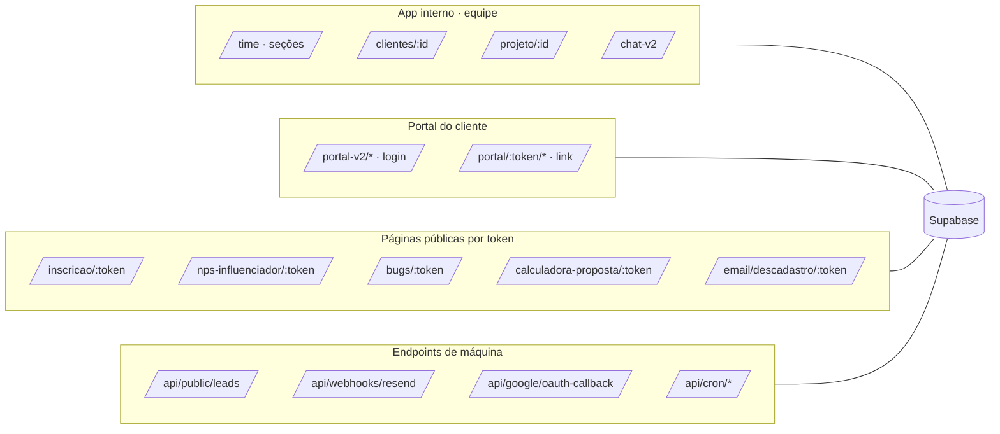

# Visão geral

## O que é
Plataforma de operação da agência **Você no Hype** (marketing de influência). Reúne, num só sistema, o que a equipe usa no dia a dia (comercial, clientes, campanhas, influenciadores, projetos e tarefas, reuniões, financeiro, metas, chat, time) e o que o **cliente** e o **influenciador** acessam por fora (portal, páginas públicas por link).

Construída no **Lovable** e conectada a um backend **Supabase** (Lovable Cloud). Produção em `https://plataforma.vocenohype.com.br` (Vercel).

## Quem usa e por onde entra

| Pessoa | Superfície | Como autentica |
|---|---|---|
| **Equipe interna** (admin ou membro com permissões) | App interno `/time`, `/clientes/$id`, `/projeto/$id`, `/chat-v2` | E-mail + senha (Supabase Auth), MFA se ativado |
| **Cliente com login** (empresa-cliente) | Portal do cliente V2 `/portal-v2/*` | E-mail + senha por convite; escopo por organização e por campanha |
| **Cliente por link** (sem login) | Portal por token `/portal/$token/*` | Token público fixo do cliente |
| **Influenciador / lead / terceiro** | Páginas públicas: inscrição, NPS, bugs, proposta, descadastro | Token na URL |
| **Sistemas externos** | Webhooks e crons: leads (Make/Typeform), Resend, Google, Vercel Cron | Segredo/assinatura/Bearer |

## As cinco superfícies

## Glossário
- **Cliente** — empresa atendida pela agência. Cada cliente tem uma **organização** dedicada (para o portal).
- **Campanha** — ação de influência de um cliente (briefing, orçamento, influenciadores, entregas, resultados).
- **Influenciador (influ)** — criador de conteúdo; existe no **Banco de Influenciadores** e é vinculado a campanhas.
- **Entrega** — conteúdo que o influenciador produz (roteiro → conteúdo → publicação), com versões e aprovação do cliente.
- **Lead / oportunidade** — registro do Comercial (pipeline); vira Cliente + Projeto na conversão.
- **Projeto** — trabalho interno (tarefas, marcos, bugs) ligado a um cliente.
- **Hypito** — assistente da plataforma. Aparece em `hypito_*` (tabelas), `hypito_payload` nas mensagens do chat e em permissões. O serviço em si **não está neste repositório** [inferido: roda fora, usa as mesmas tabelas].
- **Ambiente** — a organização em que a pessoa entra: `internal` (equipe) ou `client`.
- **Seção** — módulo dentro de `/time` (`?section=`), não é rota separada.
